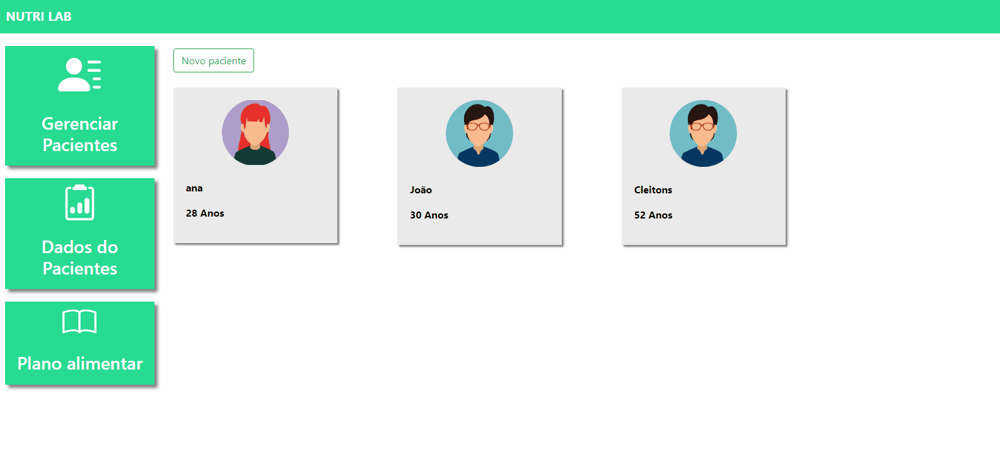
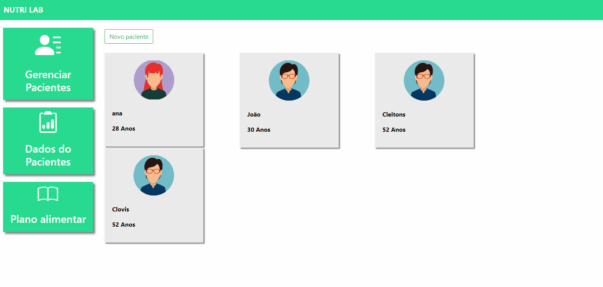
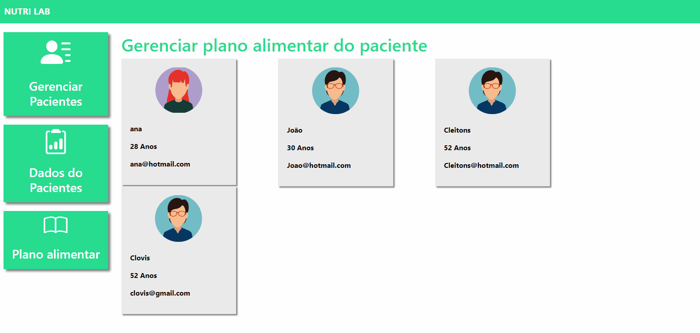

 <!-- <h4 align="center"> 
---
	🚧  Projeto NutriLab-Django 🚀 Em construção...  🚧
</h4> 

<hr> -->

<h1 align="center">NutriLab - PyStack Week 4.0</h1>


<div align="center" id="top">
  
</h1>

  
</h1>

  
</h1>

  
</h1>


  &#xa0;
 

 </div>
 
 
 <!--
 <h1 align="center">NutriLab - PyStack Week 4.0</h1>
-->

<p align="center">
  <a href="#dart-sobre">Sobre</a> &#xa0; | &#xa0; 
  <a href="#sparkles-funcionalidades">Funcionalidades</a> &#xa0; | &#xa0; 
  <a href="#rocket-tecnologias">Tecnologias</a> &#xa0; | &#xa0; 
  <a href="#white_check_mark-pré-requisitos">Pré-requisitos</a> &#xa0; | &#xa0;
  <a href="#checkered_flag-começando">Começando</a> &#xa0; 
<!--  <a href="#autor">Autor</a> -->
</p>


<br>
				
	
## :dart: Sobre ##

```sh
• Projeto feito em Django cujo o objetivo é uma aplicação para nutricionistas gerenciarem seus pacientes. 
```

## :sparkles: Funcionalidades ##


:heavy_check_mark: Autenticação, Cadastro de Usuário e login;\
:heavy_check_mark: Gerenciar pacientes criando-os;\
:heavy_check_mark: Colocar dados no paciente como peso, altura, gordura;\
:heavy_check_mark: Ao colocar os dados, aparecerá uma tabela de linha que tende a subir ou descer conforme a próximo dado;\
:heavy_check_mark: Gerenciar o plano alimentar do paciente colocando a refeição, horário, macronutrientes, descrição e imagem;\
:heavy_check_mark: Por ser um arquivo de estudo, pode conter diversos comentários que o auxiliam no uso do django.


## :rocket: Tecnologias ##
 
 
As seguintes ferramentas 🛠 foram utilizadas na construção do projeto:


<table>
  <thead>
    <th>Back-end</th>
    <th>Front-end</th>
  </thead>
  <tbody>
    <tr>
      <td>Python</td>
      <td>Bootstrap</td>
    </tr>
    <tr>
      <td>Django</td>
      <td>Html</td>
    </tr> 
    <tr>
      <td>SQLite</td>
      <td>Css</td>
    </tr>
    <tr>
      <td>Arquitetura MVT</td>
      <td>Js</td>
    </tr>  
	  
  </tbody>

</table>


## :white_check_mark: Pré-requisitos ##


Antes de começar 🏁, você vai precisar ter instalado em sua máquina as sequintes ferramentas:
[Git](https://git-scm.com/downloads), [Python](https://www.python.org/downloads/) e [DB Browser (SQLite)](https://sqlitebrowser.org/dl/).
Além disto é bom ter um editor para trabalhar com o código, tal como: [VS Code](https://code.visualstudio.com/download)


## :checkered_flag: Começando ##


```bash
# Clone este repositorio
 -> git bash here
  $ https://github.com/LucasFeliciano02/NutriLab-Django.git

# Acesse a pasta do projeto que aparecerá em sua área de trabalho
 -> mouse esquerdo -> Abrir com Code

# Colocar os seguintes comandos no terminal para ativar o Interpretador do python a fim de rodar o arquivo
 1º  ->  py -m venv venv
 2º  ->  venv\Scripts\activate.ps1  
 3º  ->  .\venv\Scripts\activate.ps1  

# Instalar bibliotecas
 -> (env) pip install django
    (env) pip install pillow
    (env) pip freeze > requirements.txt
    (env) pip install -r requirements.txt

# Criar projeto
 ->  (env) django-admin startproject nutri_lab .

# Criar apps
 ->  (env) python manage.py startapp autenticacao
     (env) python manage.py startapp plataforma

# Migrations
 ->  (env) python manage.py makemigrations
     (env) python manage.py migrate

# Executar projeto
->  (env) python manage.py runserver

OBS: Os arquivos do projeto podem ter muitos comentários pois são arquivos de estudo
```


---


<br>


<!---### Autor --->


Accomplished with :heart: by [LucasFeliciano02](https://github.com/LucasFeliciano02) 👋


[](https://www.linkedin.com/in/lucas-henrique-marques-feliciano-aa5aab222/) 


&#xa0;


<a href="#top">Voltar para o topo</a>


<!--

<table>
  <thead>
    <th>Back-end</th>
    <th>Front-end</th>
    <th>Mobile</th>
  </thead>
  <tbody>
    <tr>
      <td>Node.js</td>
      <td>ReactJS</td>
      <td>React Native - Expo</td>
    </tr>
    <tr>
      <td>ExpressJs</td>
      <td>Styled-Components</td>
      <td>Styled-Components</td>
    </tr>
    <tr>
      <td>SqLite</td>
      <td>Axios</td>
      <td>Axios</td>
    </tr>
    <tr>
      <td>Nodemon</td>
      <td>React Hooks</td>
      <td>React Hooks</td>
    </tr>
    <tr>
      <td>Cors</td>
      <td>Eslint</td>
      <td>Eslint</td>
    </tr>
    <tr>
      <td>Knex</td>
      <td>Prettier</td>
      <td>Prettier</td>
    </tr>
    <tr>
      <td>Jest</td>
      <td>Jest</td>
      <td>Jest</td>
    </tr>
  </tbody>

</table>

-->

